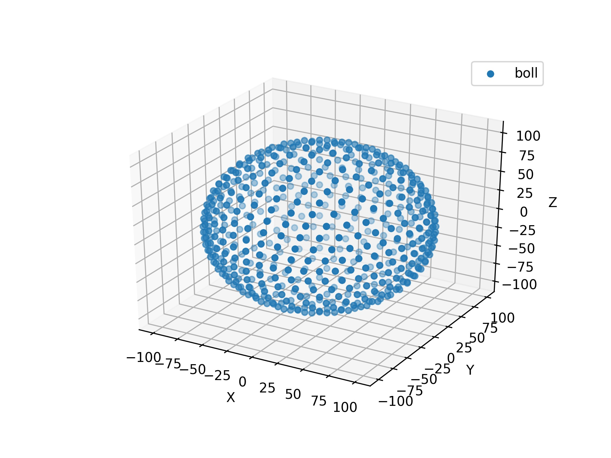
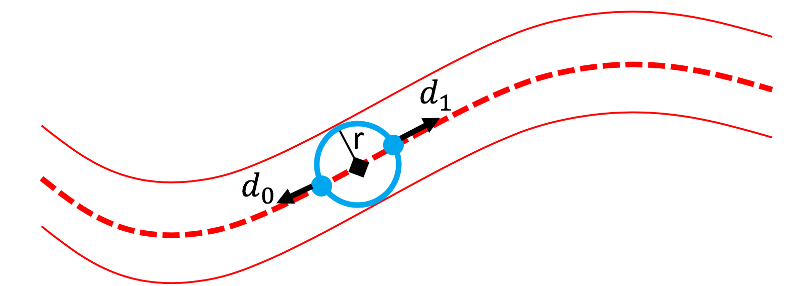
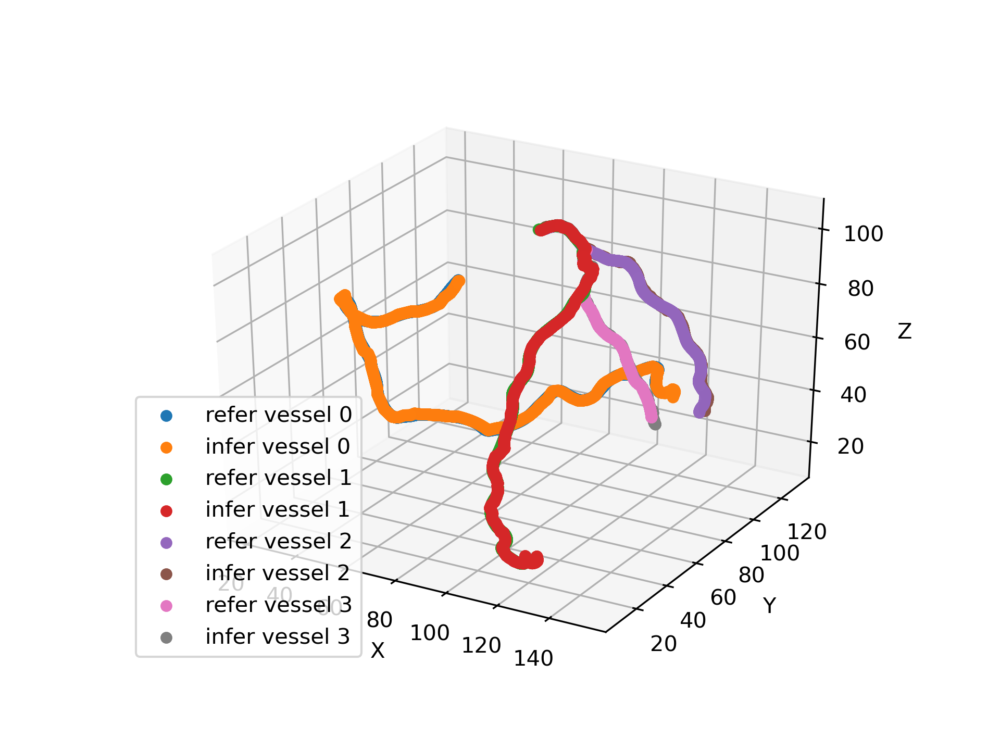
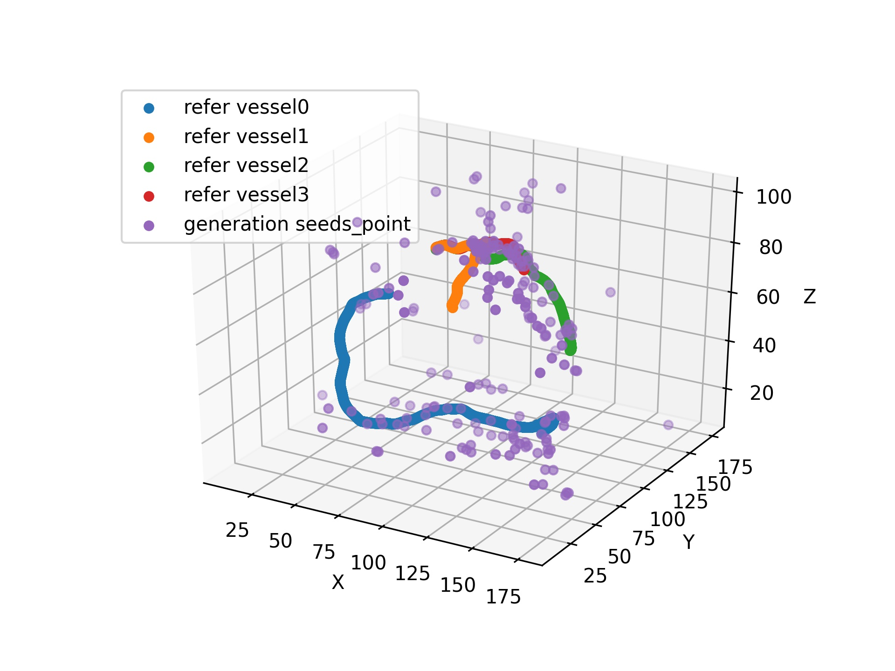

# Coronary Artery Tracking via 3D CNN Classification Pytorch

The PyTorch re-implement of a 3D CNN Tracker to extract coronary artery centerlines with state-of-the-art (SOTA) performance. (paper: '_Coronary artery centerline extraction in cardiac CT angiography using a CNN-based orientation classifier_')

paper link: https://www.sciencedirect.com/science/article/abs/pii/S1361841518308491

# Key idea
```
#  A 3D dilated CNN is trained to predict the most likely direction and radius of an artery at any given point in a CCTA image based on a local image patch.
We use a 3D Fibonacci ball to model a CNN Tracker, where the radius of the ball represents the radius of the vessel at the current position, and the points on the ball represent a possible direction of movement.
```



```
Starting from a single seed point placed manually or automatically anywhere in a coronary artery, a tracker follows the vessel centerline in two directions using the predictions of the CNN. 

Tracking is terminated when no direction can be identified with high certainty.
```
 

```
In order to create a vessel tree automatically, we need to train three neural networks. 
Firstly, we need to train a centerline net to predict the two directions(d0, d1) of the current position that can be moved and the vessel radius. 
Secondly, we need to train a neural network to find two entrance points of a coronary artery. 
The third network is responsible for placing seed points in the image 
```
## Architecture of Centerline Net

|  Layer   | 1  | 2 |  3 | 4 | 5 | 6 | 7 |  
|  ----  | ----  | ---- | ---- | ---- | ---- | ---- | ---- |
| Kernel width  | 3 | 3 | 3 | 3 | 3 | 1 | 1 |
| Dilation  | 1 | 1 | 2 | 4 | 1 | 1 | 1 |
| Channels | 32 | 32 | 32 | 32 | 64 | 64 | D+1 |
| Field width | 3 | 5 | 9 | 17 | 19 | 19 | 19 |

```
The number of output channels is equal to the number of potential directions in D, plus one channel for radius estimation.

The architecture of seedspint_net and ostiapoint_net are very similar to centerline_net. The only difference is in the output layer: instead of combining classification and regression, the final layer only performs regression.
```

# Requirement
```bash
$ pip install -r requirement.txt
```
# Training

## 1. Preparing CTA08 dataset
``` 

tips: CAT08 datasets need to be registered and certified in the website(http://coronary.bigr.nl/centerlines/) before it can be downloaded

It should be noted that your registration email may not be received by the server of the above website. 

If you have this problem, please contact the Dr.Theo van Walsum(t.vanwalsum@erasmusmc.nl)

1. Unzip training.tar.gz to 
    Coronary-Artery-Tracking-via-3D-CNN-Classification/
            -data_process_tools/
                -training_data/
                    -dataset00/
                    -dataset01/
                    -dataset02/
                    -dataset03/
                    -dataset04/
                    -dataset05/
                    -dataset06/
                    -dataset07/

2. Create spacing_info.csv and nii.gz data

python3 creat_spacinginfo_data_tool.py

3. Create centerline patch data      

$ Create no offset samples
python3 centerline_patch_generater_no_offset.py
     
$ Create samples with offset                         
python3 centerline_patch_generater_offset.py

4. Create seeds patch data         

$ Create positve samples
python3 seedpoints_patch_generater_postive.py     

$ Create negative sample    
python3 seedpoints_patch_generater_negative.py

those two script will automaticlly create folds
-data_process_tools/
    -patch_data/
         -centerline_patch/
            -no_offset/
                 -point_500_gp_1/
                     -d0/
                     d0_patch_info_500.csv 
                     .
                     .
                     .
                     -d7/
                     d7_patch_info_500.csv
            -offset/
                  -point_500_gp_1/
                     -d0/
                     d0_patch_info_500.csv
                     .
                     .
                     .
                     -d7/
                     d7_patch_info_500.csv
5. Create osita patch data

$ Create positve samples 
python3 ostiapoints_patch_generater_positive.py

$ Create negative sample    
python3 ostiapoints_patch_generater_negative.py

It should be noted that 8 samples corresponding to the data will be produced here, and the specific training set and test set division also need to write your own code to divide the data set and generate the train CSV file and val CSV file

```                                            
## 2.Training Models
```bash
1. Training centerline net

cd centerline_train_tools/

CUDA_VISIBLE_DEVICES=0 python3 centerline_train_tools.py

2. Training seedpoints net

cd seedspoints_train_tools/

CUDA_VISIBLE_DEVICES=0 python3 seeds_train_tools.py

3. Training ostiapoints net

cd ostiapoints_train_tools

CUDA_VISIBLE_DEVICES=0 python3 ostia_train_tools.py 
```
## 3.Create coronary artery vessels tree
```bash
cd infer_tools_tree/

First, you need to be modified settingy.yaml
Replace the path inside to the path of the file you saved

python3 vessels_tree_infer.py
```               
The predict vessel tree is shown in the figure below           

```
The vessels from different seed points are spliced by breadth-first search, and then a complete single vessel is generated by depth-first search
```

Seedpoints net will generate 200 seed points as shown in the figure below. 

It can be seen that the seed points are distributed near several coronary arteries
# References

``` 
@article{wolterink2019coronary,
  title={Coronary artery centerline extraction in cardiac CT angiography using a CNN-based orientation classifier},
  author={Wolterink, Jelmer M and van Hamersvelt, Robbert W and Viergever, Max A and Leiner, Tim Leiner, Ivana},
  journal={Medical image analysis},
  volume={51},
  pages={46--60},
  year={2019},
  publisher={Elsevier}
}
```


